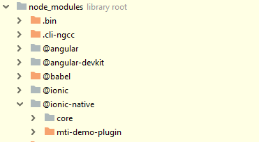
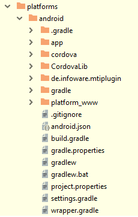
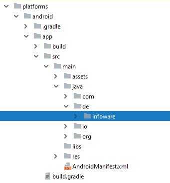
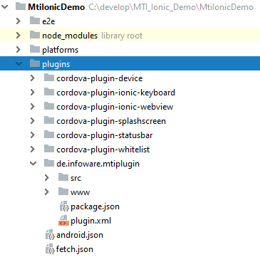
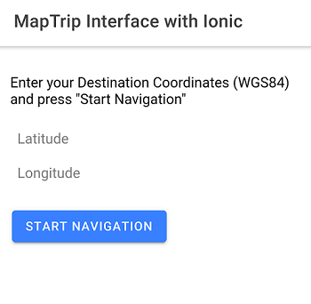
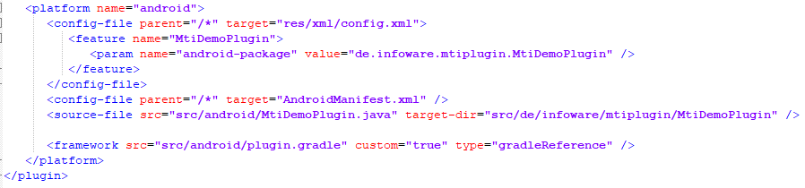

# Using MTI with Ionic

This project is meant to show how to integrate [MTI](http://www.maptrip.de/docs/mti/) with your *Ionic cordova* application.  

This includes an example mti-plugin, which is necessary to call native java-code from your application, the ionic-wrapper to wrap the native-calls as Promises or Observables, and the Ionic-Project itself.  

The available functionality is limited to sending a WGS84-Coordinate to *MapTrip*, calculating and starting the navigation, and switching to *MapTrip* when the navigation has been started. With these examples you will learn how to send the MTI-requests to the native side of the app, and how to receive the necessary callbacks from MTI and handle them in your ionic-app.

***
## Preparations

First of all you need the *MapTrip* application installed and running on your Phone.

To build this app, you'll need to have npm installed.  
With npm, install ionic and cordova globally:  
```
npm install -g ionic   
npm install -g cordova 
```  

If you want to create your own plugin, you'll also need to have plugman installed:
```
npm install -g plugman
```  

To create your own wrapper for your plugin, make sure gulp is also installed:
```
npm install -g gulp
```  
and clone the [ionic native repository](https://github.com/ionic-team/ionic-native). From there on, follow the [instructions](https://github.com/ionic-team/ionic-native/blob/master/DEVELOPER.md) to create your wrapper.   

***
## Installing the app

After downloading the project, run 
```
npm install
```
to create the node_modules directory and download all dependencies.  

Next you'll need to install *@ionic-native/core*.
```
npm install @ionic-native/core@latest
```
Now you have to download the ionic wrapper *mti-demo-plugin* from this repository, and copy it into the *node_modules/@ionic-native* directory, as seen here:   


  
Please note that 'npm install' or adding / removing the plugin may delete the wrapper. If it does, simply copy it back into the directory before you build your apk.

***

To install the plugin you need to add *android* as platform in your ionic project:
```
ionic cordova platform add android
```
After running this command the following directory should have been created:



Now your ready to install the plugin itself. First download it from this repository.
Afterwards, use either
```
ionic cordova plugin add <PathToPlugin>
```  
or   
```
plugman install --platform android --project ./platforms/android --plugin <PathToPlugin>
```  
to add it to the project.  


To confirm the installation, check  
```
ionic cordova plugins list
```  
to see all installed plugins.  
  
You can also see if the plugin is installed in the platforms/android/app/src/main/java directory 
 
    

and in the plugins directory.  

  
  
  
***
Now that you have everything the app needs, you can run
```
ionic cordova build android 
```
to create an apk. Copy this apk on your phone, and install it.   
***
## Using the App

Please note that the Demo-App expects an already running *MapTrip*, as it will not start *MapTrip* by itself.  
By starting the Demo-App, the connection to *MapTrip* via MTI should already be established, and you will see this screen:

  

Now enter a valid WGS84-Coordinate and press "Start navigation". The app will send those coordinates to *MapTrip*, and will show *MapTrip* automatically when the route has finished calculating and the navigation has been started.  

If you switch back to the Ionic-app, you will see a label, where current navigation-information (the next street on your route, and the distance to the crossing in meters) is being displayed.   

## Use MTI with your own plugin

To use the MTI-functionality for your own plugin, you need to add the dependency.
In this example we use a custom gradle-file, which gets compiled into the base gradle-file of your ionic/android project. It is located in *MTIDemoPlugin/src/android/plugin.gradle*.  

To include plugin.gradle, you need to modify the plugin.xml located in the root directory of your plugin.  
   
Simply add  
```
<framework src="src/android/plugin.gradle" custom="true" type="gradleReference" />
```
to your plugin.xml, as seen here:  



With this you will have full control of *MapTrip* from inside your *ionic* application! 
